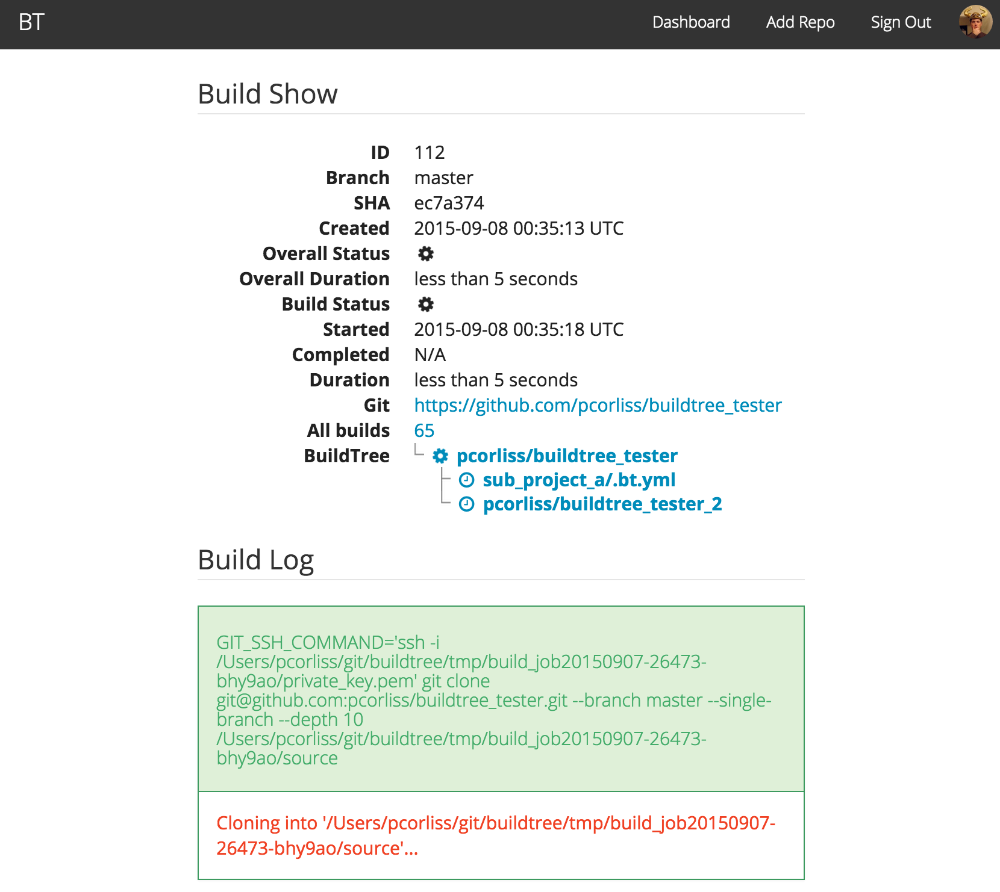
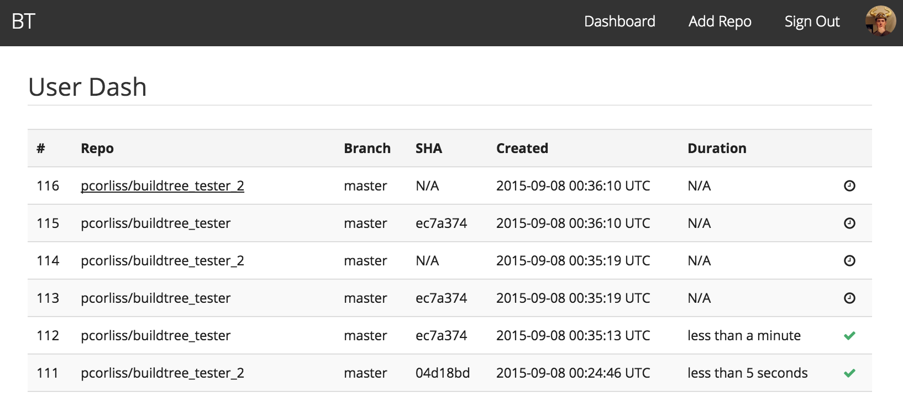
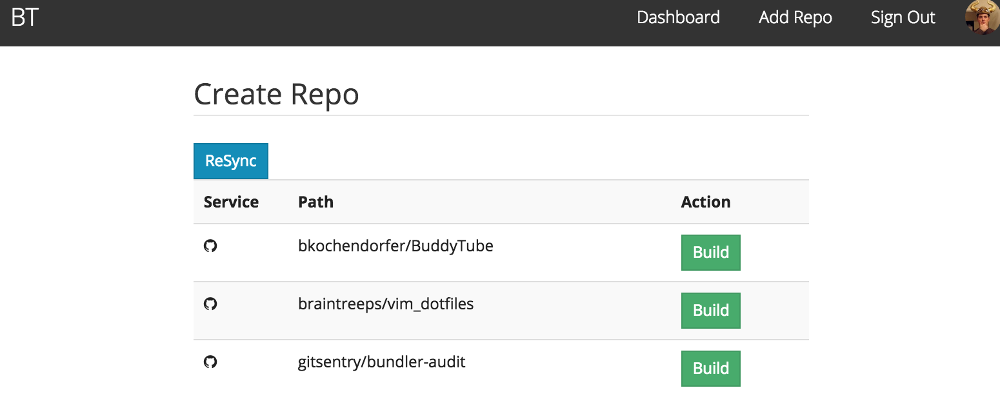

# BuildTree v2

BuildTree is an open source continous integration service.

## Features

* Github OAuth integration
* Github commits kick off builds
* Builds are isolated from one another
* Docker based build images
* Code based configuration of builds
* Parallel and After Success Builds
* SubProject builds

## Local Development

### Required Keys/Tokens

Generate OAuth Keys [via Github](https://github.com/settings/applications/new)

Use `http://<hostname>:<port>/` and `http://<hostname>:<port>/auth` as
your Homepage and Callback URL.

### Local Dev Machine Setup

```
# Update .env with GITHUB_KEY, GITHUB_SECRET, and (optionally) GHE_HOST
cp .env.example .env

# If you are using GHE 2.2.x and want access to Repositories owned by your
# Organizations/Teams, you'll need to uncomment the line in
# config/initializers/octokit.rb that reads:
# c.default_media_type = "application/vnd.github.moondragon+json"

# Start Postgres
# Create a buildtree user with permissions
createuser --createdb buildtree

git clone https://github.com/pcorliss/buildtree.git
cd buildtree

# RVM is what I use but as long as ruby-2.2.1 is installed you should be okay
bundle install
rake db:create:all
rake db:migrate

spring rspec
rails server

# Build Worker Requires
# >= git 2.3
# Running docker host `docker ps -a`
./bin/delayed_job run --sleep-delay=5
```

## Running BuildTree via Docker Compose on a Single Host

```
rake secret # SECRET_KEY_BASE
pwgen -s1 16 # POSTGRES_PASS & POSTGRES_PASSWORD
pwgen -s1 16 # SSH_PASSPHRASE
host -f # HOST

cp docker-compose.yml.example my-buildtree.yml
cp .env-compose.example .env-compose

# If using boot2docker set HOST to the hostname of your VM
docker-compose -f my-buildtree.yml up -d db
docker-compose -f my-buildtree.yml run app bundle exec rake db:migrate
docker-compose -f my-buildtree.yml up --no-recreate
```

## Roadmap

Buildtree doesn't have a formal road map but does have an extensive list
of feature [TODOs](TODO.md)

## Screenshots






